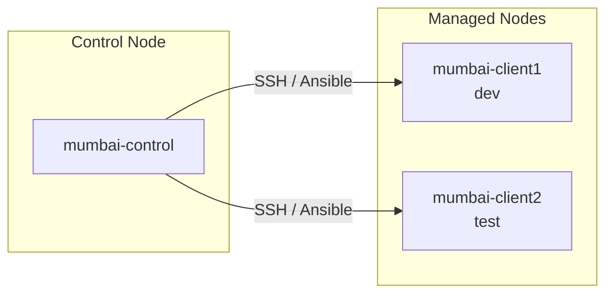

# AWS Ansible Automation

Ansible-based infrastructure automation for **ITFS Task 1, Mission 1**. This repository provisions and configures three EC2 instances in AWS Mumbai (`ap-south-1`): one control node and two managed nodes grouped as `dev` and `test`.

## Overview

| Component | Host | Group | Purpose |
|-----------|------|-------|---------|
| Control node | `mumbai-control` | — | Runs Ansible, Docker, and ansible-navigator |
| Managed node 1 | `mumbai-client1` | `dev` | Development server (packages, `/etc/issue`, custom web page) |
| Managed node 2 | `mumbai-client2` | `test` | Test server (packages, `/etc/issue`, role-based web page) |



## Tech Stack

- **Cloud:** AWS EC2 (Mumbai region)
- **OS:** Amazon Linux 2023 (`dnf` package manager)
- **Automation:** Ansible, ansible-navigator
- **Container runtime:** Docker (on control node)
- **Web server:** Apache (`httpd`)
- **Packages:** MariaDB 10.5, PHP, Development Tools (dev only)

## Project Structure

```
.
├── ansible.cfg              # Ansible defaults (inventory path, remote user)
├── ansible-navigator.yml    # Execution environment for ansible-navigator
├── inventory                # Host groups: dev, test
├── packages.yml             # Package installation on dev and test
├── issue.yml                # /etc/issue banner configuration
├── custom.yml               # Apache + custom homepage on dev
├── myrole.yml               # Applies myrole to test group
└── myrole/                  # Role: Apache + test homepage
    ├── tasks/main.yml
    ├── defaults/main.yml
    ├── handlers/main.yml
    ├── meta/main.yml
    └── tests/
```

## Prerequisites

Before running playbooks, ensure the following are in place:

1. **Three EC2 instances** in `ap-south-1` running Amazon Linux 2023
2. **`devops` user** on all nodes with passwordless SSH from the control node to managed nodes
3. **Ansible** installed on the control node (typically under `/home/devops/ansible/`)
4. **Python 3** available on managed nodes (`/usr/bin/python3`)
5. **Docker** and **ansible-navigator** on the control node (optional, for EE-based runs)

## Configuration

### Inventory

Update `inventory` with your instance IPs before running playbooks:

```ini
[dev]
mumbai-client1 ansible_host=<dev-server-ip>

[test]
mumbai-client2 ansible_host=<test-server-ip>

[all:vars]
ansible_user=devops
ansible_python_interpreter=/usr/bin/python3
```

### Ansible config

`ansible.cfg` points to the inventory on the control node and sets the remote user:

```ini
[defaults]
inventory = /home/devops/ansible/inventory
host_key_checking = False
retry_files_enabled = False
remote_user = devops
```

> **Note:** Adjust the `inventory` path in `ansible.cfg` if you clone this repo to a different location on the control node.

## Playbooks

Run all commands from the control node inside the project directory (e.g. `/home/devops/ansible/`).

| Playbook | Target | Description |
|----------|--------|-------------|
| `packages.yml` | `dev`, `test` | Installs MariaDB 10.5 and PHP on both groups; updates all packages and installs `@Development Tools` on `dev` only |
| `issue.yml` | `dev`, `test` | Sets `/etc/issue` to `development` on dev and `test` on test |
| `custom.yml` | `dev` | Installs Apache, enables the service, and deploys a custom dev homepage |
| `myrole.yml` | `test` | Applies the `myrole` role (Apache + test homepage) |

### Example usage

```bash
# Install packages
ansible-playbook packages.yml

# Configure login banners
ansible-playbook issue.yml

# Deploy dev web server
ansible-playbook custom.yml

# Deploy test web server via role
ansible-playbook myrole.yml
```

Verify connectivity first:

```bash
ansible all -m ping
```

### Recommended execution order

1. `packages.yml` — base packages and dev tooling
2. `issue.yml` — environment banners
3. `custom.yml` — dev web server
4. `myrole.yml` — test web server

## Role: `myrole`

The `myrole` role configures the test server web stack:

1. Installs Apache (`httpd`) via `dnf`
2. Starts and enables the `httpd` service
3. Deploys `/var/www/html/index.html` with a test server welcome page

Invoked by `myrole.yml`:

```yaml
- name: Apply myrole to test group
  hosts: test
  become: true
  roles:
    - myrole
```

## ansible-navigator

`ansible-navigator.yml` configures an execution environment using the official Ansible creator image:

```yaml
ansible-navigator:
  execution-environment:
    enabled: true
    image: ghcr.io/ansible/creator-ee:v0.22.0
```

Run playbooks through the EE (requires Docker):

```bash
ansible-navigator run packages.yml
ansible-navigator run issue.yml
ansible-navigator run custom.yml
ansible-navigator run myrole.yml
```

## Tasks Completed (Mission 1)

1. Created 3 EC2 instances in AWS Mumbai region
2. Configured passwordless SSH access for the `devops` user
3. Installed Docker and ansible-navigator on the control node
4. Configured Ansible inventory and connectivity
5. Executed package installation playbook
6. Created and executed role for test server web page
7. Configured `/etc/issue` on dev and test servers
8. Created custom web page on dev server

## Notes

- All package management uses `dnf` (Amazon Linux 2023).
- `host_key_checking` is disabled in `ansible.cfg` for lab convenience; enable it in production.
- Replace placeholder or stale IPs in `inventory` before use; committed IPs may not match your current instances.
