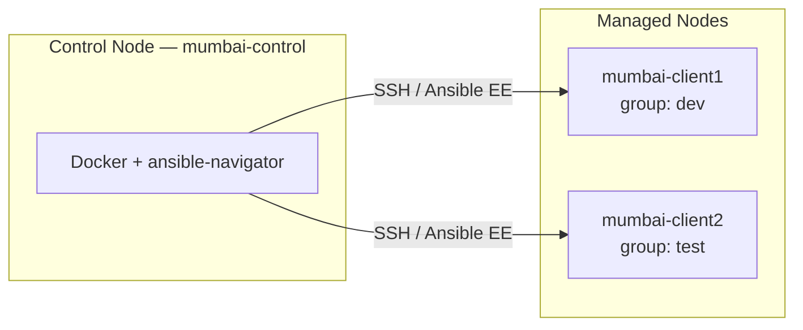

# AWS Ansible Automation

Ansible-based infrastructure automation for **ITFS Task 1, Mission 1**. This repository provisions and configures three EC2 instances in AWS Mumbai (`ap-south-1`): one control node and two managed nodes grouped as `dev` and `test`.

## Overview

### Infrastructure

Three EC2 instances in **AWS Mumbai (`ap-south-1`)**:

| Instance type | Name | Ansible group |
|---------------|------|---------------|
| Control node | `mumbai-control` | — |
| Client node 1 | `mumbai-client1` | `dev` |
| Client node 2 | `mumbai-client2` | `test` |

**Setup requirements:**

- `devops` user on all machines with SSH key-based authentication
- Project directory on control node: `/home/devops/ansible`
- All playbooks executed via **Docker** and **ansible-navigator** only

> **Important:** `ansible-playbook <playbook_name>` is **not permitted** for this mission. Use container-based execution only.



### Ansible configuration (Task 2)

| Deliverable | Path on control node |
|-------------|----------------------|
| Inventory | `/home/devops/ansible/inventory` |
| Ansible config | `/home/devops/ansible/ansible.cfg` |

Inventory rules:

- `mumbai-client1` → group `dev`
- `mumbai-client2` → group `test`

**Verification:** demonstrate connectivity with Ansible (via ansible-navigator).

### Package management (Task 3)

**File:** `packages.yml`

| Target | Packages / actions |
|--------|-------------------|
| Groups `dev` and `test` | `mariadb105`, `php` |
| Group `dev` only | `@Development Tools` group |
| Group `dev` only | Update all packages |

**Verification:** show successful playbook execution and installed packages.

### Role and template (Task 4)

| Deliverable | Path |
|-------------|------|
| Role | `/home/devops/ansible/roles/myrole` |
| Template | `roles/myrole/templates/index.j2` |
| Playbook | `/home/devops/ansible/myrole.yml` |

**Role requirements:**

- Configure Apache web server on group `test`
- Template renders: `Welcome to <full hostname> on <IP address>`

```jinja2
Welcome to {{ ansible_fqdn | default(ansible_hostname) }} on {{ ansible_default_ipv4.address }}
```

**Verification:** access the web page via browser or `curl`.

### Login banner (Task 5)

**File:** `issue.yml`

Replace `/etc/issue` content:

| Group | Expected content |
|-------|------------------|
| `dev` | `development` |
| `test` | `test` |

**Verification:** display `/etc/issue` on each host.

### Custom web server (Task 6)

**File:** `custom.yml`

Configure Apache on group `dev`:

| Setting | Value |
|---------|-------|
| Document root | `/webdev` |
| Web page content | `development` |
| Symbolic link | `/webdev` → `/var/www/html` |

**Verification:** open the web page and confirm content.

### Git integration (Task 7)

Push to this repository:

- `inventory`
- `ansible.cfg`
- `packages.yml`
- `myrole.yml`
- `issue.yml`
- `custom.yml`
- `roles/myrole`

---

## Mission 2 — Infrastructure Recreation Using Git

Mission 2 reuses this repository in a **new AWS Hyderabad region** environment:

| Instance | Name |
|----------|------|
| Control node | `hyderabad-control` |
| Client 1 | `hyderabad-client1` |
| Client 2 | `hyderabad-client2` |

- User: `clone` (instead of `devops`)
- Project directory: `/home/clone/ansible`
- Clone this Git repo, update inventory for the new IPs, and re-run all playbooks with **ansible-navigator**

**Validation:** successful execution of `packages.yml`, `myrole.yml`, `issue.yml`, and `custom.yml`.

---

## Repository Contents

```
.
├── ansible.cfg              # Ansible defaults (inventory path, remote user)
├── ansible-navigator.yml    # Execution environment for ansible-navigator
├── inventory                # dev / test host groups
├── packages.yml             # Task 3 — package installation
├── issue.yml                # Task 5 — /etc/issue banners
├── custom.yml               # Task 6 — Apache on dev
├── myrole.yml               # Task 4 — applies myrole to test group
└── roles/myrole/            # Task 4 — Apache + templated web page
    ├── templates/index.j2
    ├── tasks/main.yml
    └── meta/main.yml
```

## Tech Stack

- **Cloud:** AWS EC2 (Mumbai — Mission 1; Hyderabad — Mission 2)
- **OS:** Amazon Linux 2023 (`dnf`)
- **Automation:** ansible-navigator (execution environment inside Docker)
- **Web server:** Apache (`httpd`)
- **Packages:** MariaDB 10.5 (`mariadb105`), PHP, Development Tools (dev only)

## Prerequisites

1. Three EC2 instances in the target region (Amazon Linux 2023)
2. Mission user created on all nodes (`devops` for Mission 1, `clone` for Mission 2) with SSH key access from the control node
3. **Docker** and **ansible-navigator** on the control node
4. Project deployed under `/home/devops/ansible/` (Mission 1) or `/home/clone/ansible/` (Mission 2)
5. Python 3 on managed nodes (`/usr/bin/python3`)

## Configuration

### Inventory

Update `inventory` with your instance IPs before running playbooks:

```ini
[dev]
mumbai-client1 ansible_host=<dev-server-ip>

[test]
mumbai-client2 ansible_host=<test-server-ip>

[all:vars]
ansible_user=devops
ansible_python_interpreter=/usr/bin/python3
```

### Ansible config

```ini
[defaults]
inventory = /home/devops/ansible/inventory
host_key_checking = False
retry_files_enabled = False
remote_user = devops
```

## Running Playbooks

All playbooks **must** be executed with ansible-navigator from `/home/devops/ansible/` on the control node.

### Execution environment

`ansible-navigator.yml`:

```yaml
ansible-navigator:
  execution-environment:
    enabled: true
    image: ghcr.io/ansible/creator-ee:v0.22.0
    pull:
      policy: missing
  ansible:
    config:
      path: /home/devops/ansible/ansible.cfg
```

### Commands

Verify connectivity:

```bash
ansible-navigator exec -- ansible all -m ping
```

Run playbooks (recommended order):

```bash
ansible-navigator run packages.yml   # Task 3
ansible-navigator run issue.yml      # Task 5
ansible-navigator run custom.yml     # Task 6
ansible-navigator run myrole.yml     # Task 4
```

### Verification examples

```bash
# Task 5 — check /etc/issue
ansible-navigator exec -- ansible dev -m command -a "cat /etc/issue"
ansible-navigator exec -- ansible test -m command -a "cat /etc/issue"

# Task 4 — test web page (replace with test host IP)
curl http://<test-server-ip>/

# Task 6 — dev web page (replace with dev host IP)
curl http://<dev-server-ip>/
```

## Playbook Reference

| Playbook | Task | Target | Purpose |
|----------|------|--------|---------|
| `packages.yml` | 3 | `dev`, `test` | Installs `mariadb105` and PHP; updates packages and installs Development Tools on `dev` |
| `issue.yml` | 5 | `dev`, `test` | Sets `/etc/issue` to `development` (dev) or `test` (test) |
| `custom.yml` | 6 | `dev` | Apache with `/webdev` document root, `development` page content, and `/webdev` symlink |
| `myrole.yml` | 4 | `test` | Apache web server via `myrole` using `index.j2` template |

## Notes

- Package management uses `dnf` on Amazon Linux 2023 (MariaDB package may appear as `mariadb105` in the playbook).
- `host_key_checking` is disabled in `ansible.cfg` for lab use; enable it in production.
- Replace IPs in `inventory` before running against live instances.
